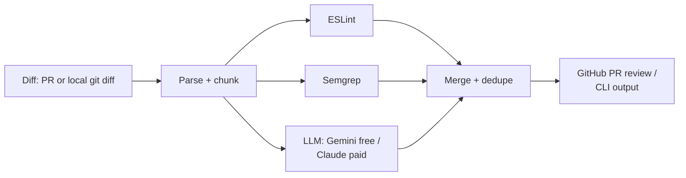

# AI Code Review

Hybrid code review that combines deterministic static analysis (ESLint,
Semgrep) with an LLM reviewer, ships as a **GitHub Action** that comments
directly on pull requests, and doubles as a local **CLI**. The LLM layer is
swappable — **Gemini by default (free, no credit card) or Claude
(paid)** — behind one `LLMReviewer` interface; static analysis and the eval
harness don't care which one is plugged in. It comes with an eval harness
that scores the tool against a small set of synthetic bugs with known
ground truth, instead of asking you to take "the AI reviews your code" on
faith.

> **If you're reading this as part of a job application review:** the parts
> worth a closer look are [`src/merge/dedupe.ts`](src/merge/dedupe.ts) (the
> cross-source dedup logic, and the bug `tests/merge.test.ts` caught in it),
> [`eval/runEval.ts`](eval/runEval.ts) (the scoring harness), and the
> graceful-degradation pattern repeated in both
> [`analyzers/`](src/analyzers) (what happens when ESLint/Semgrep aren't
> configured) and [`llm/reviewer.ts`](src/llm/reviewer.ts) (what happens
> when one chunk's API call fails). Those are the design decisions, not just
> the "call the API" part.

## Why hybrid, and why an eval

A tool that pipes a diff into an LLM and prints whatever comes back is easy
to build and easy to spot. Two things separate a reviewer that's actually
useful from one that just demos well:

1. **Static analysis should own what it's good at.** Pattern-matchable bugs
   (hardcoded secrets, string-concatenated SQL) are cheap and deterministic
   to catch with ESLint/Semgrep. Burning LLM calls on those is slower, costs
   money, and isn't more reliable than a rule. The LLM's system prompt
   ([`src/llm/prompts.ts`](src/llm/prompts.ts)) is explicitly told what
   static analysis already found and instructed not to repeat it — its job
   is logic errors, boundary conditions, and misuse that require
   understanding intent, not pattern matching.
2. **"It works" needs a number, not an anecdote.** [`eval/`](eval) contains
   5 synthetic PRs with a known, deliberately-injected bug each (plus one
   clean control case) and ground-truth annotations. `eval/runEval.ts` runs
   the real pipeline against each one and computes precision/recall — see
   [Eval results](#eval-results) below.

## Architecture



Static analysis runs first and its findings are fed to the LLM as context
per chunk, so the model knows what's already covered. All three sources
converge in [`merge/dedupe.ts`](src/merge/dedupe.ts), which collapses
cross-source duplicates (the same bug caught twice) while leaving distinct
same-source findings alone, ranks by severity, and applies the configured
threshold.

## Quickstart

## Cost

- **Static analysis (ESLint, Semgrep) and GitHub Actions minutes:** free —
  unlimited on public repos, 2,000 min/month on private repos on GitHub's
  Free plan, which a lint+review job won't come close to.
- **LLM review, provider = `gemini` (the default):** free. Get a key at
  [aistudio.google.com/apikey](https://aistudio.google.com/apikey) — no
  credit card, a daily request quota generous enough that a normal repo's
  PR volume won't hit it.
- **LLM review, provider = `anthropic`:** paid, pay-per-token from the
  first call. A few cents per PR reviewed in practice. Switch to it in
  [`.aicodereview.yml`](.aicodereview.yml) if you want to compare quality.

### As a GitHub Action

```yaml
# .github/workflows/review.yml
on: pull_request
jobs:
  review:
    runs-on: ubuntu-latest
    steps:
      - uses: actions/checkout@v4
      - uses: your-org/ai-code-review@v1
        with:
          gemini-api-key: ${{ secrets.GEMINI_API_KEY }}
```

Posts one PR review with inline comments on the flagged lines. Swap to
`anthropic-api-key: ${{ secrets.ANTHROPIC_API_KEY }}` (and set
`provider: anthropic` in config) to use Claude instead.

### As a CLI

```bash
npm install -g ai-code-review   # or: npx ai-code-review
export GEMINI_API_KEY=...       # free key, no credit card

ai-code-review --staged          # review staged changes
ai-code-review --base main       # review against a branch
ai-code-review --diff changes.patch --format json
```

Without a key set for the configured provider, the CLI falls back to
`MockReviewer` with a clear stderr warning rather than failing — useful for
trying the tool, or for `MOCK_LLM=1` to force that path explicitly (see
[Eval results](#eval-results)). The GitHub Action does the opposite: it
fails loudly if its provider's key is missing, since silently posting a
mock-based "no issues found" review on a real PR would be actively
misleading.

## Configuration

Everything is optional — see [`.aicodereview.yml`](.aicodereview.yml) for
every field with inline explanations (model, severity threshold,
ignore-paths, which categories to report, fail-the-check threshold).

## Eval results

```
$ npm run eval

✔ case-01-sql-injection      1/1 caught, 0 false alarms
✔ case-02-hardcoded-secret   1/1 caught, 0 false alarms
● case-03-null-deref         0/1 caught, 0 false alarms
● case-04-off-by-one         0/1 caught, 0 false alarms
● case-05-clean-code         0/0 caught, 2 false alarms

Precision 50% · Recall 50% · F1 50%
```

Full per-case detail: [`eval/report.md`](eval/report.md).

**Read this carefully: those numbers are from `MockReviewer`, a
deliberately naive regex-based stand-in for the real model** (see
[`src/llm/client.ts`](src/llm/client.ts)), used so the eval harness itself —
chunking, merging, scoring — can be validated and unit-tested without an API
key or per-run cost. **It is not a benchmark of any real model's review
quality.** The two misses are exactly the point: `case-03` needs
understanding that `user.profile` might be `undefined`, and `case-04` needs
recognizing `i <= end` as an off-by-one — neither is regex-matchable, both
are squarely what an LLM reviewer is for. Run the real model and score it
properly:

```bash
export GEMINI_API_KEY=...   # free — https://aistudio.google.com/apikey
npm run eval -- --live
```

I'd expect materially better recall on `case-03`/`case-04` from a real model
actually reasoning about the code, and I don't want to claim that without
the number in hand — this README will get updated with live results, not
a guess. **Also worth knowing:** `GeminiReviewer` is implemented against
Google's documented `generateContent` REST contract and passes schema
validation on well-formed input, but I didn't have a live API key in the
environment that built this, so it hasn't actually been run against the
real API yet — running `--live` yourself is the first real test of it, not
just a formality.

One honest footnote: an earlier version of the dedup logic under-reported
`case-05`'s false positives (it collapsed two separate bad flags into one,
because it didn't check that they came from the *same* source before
treating them as duplicates). `tests/merge.test.ts` caught it during
development — the current numbers above are post-fix.

## Project structure

```
src/
  diff/         unified diff parsing + chunking to fit a context budget
  analyzers/    ESLint + Semgrep, each degrades to [] if unavailable
  llm/          Gemini + Claude clients (+ mock), prompts, structured-output schema, provider selection
  merge/        cross-source dedup, severity ranking, fail-threshold logic
  github/       PR diff fetch + inline review comments (Action mode)
  config/       .aicodereview.yml loading
  report/       console + JSON formatting
  pipeline.ts   wires it all together; shared by both entrypoints
  cli.ts        CLI entrypoint
  index.ts      GitHub Action entrypoint
eval/           synthetic cases with ground truth + the scoring harness
tests/          unit tests (diff parsing, merge/dedupe) — no network, no LLM
semgrep-rules/  bundled offline ruleset (no registry access required)
```

## Local development

```bash
npm install
npm run build       # compile src/ -> dist/
npm run typecheck   # type-check src/ + eval/ together
npm test            # unit tests, no network/API key needed
npm run eval         # scored run against eval/cases (mock by default)
```

## Known limitations

- Findings are matched to ground truth (and deduped across sources) by
  file + line proximity (±2 lines), not exact diff position — dense diffs
  with several distinct issues close together could occasionally
  mis-attribute.
- The ESLint layer only contributes if the target repo already has its own
  ESLint config; no config means it silently reports nothing, by design.
- The bundled Semgrep ruleset is intentionally small (2 rules: SQL
  injection via concatenation, hardcoded secrets) so scans work fully
  offline. Point `semgrepConfig: auto` at Semgrep's hosted registry in
  `.aicodereview.yml` for broader coverage if your network allows it.
- Each chunk is reviewed with only its own file's diff as context — a bug
  that's only apparent from reading two files together won't be caught.
- 5 eval cases is enough to validate the pipeline and give an honest
  starting number, not enough to be a statistically rigorous benchmark.
  Growing `eval/cases/` is the natural next step.
- Gemini's free tier is rate- and quota-limited (daily request cap, not
  published as a fixed guaranteed number) rather than a paid SLA — fine for
  a personal repo's PR volume, worth checking Google AI Studio's quota page
  before relying on it for a busy team repo.
- `GeminiReviewer` hasn't been exercised against the live API in this
  environment specifically (no key available where this was built) — see
  the caveat under [Eval results](#eval-results).

## License

MIT — see [LICENSE](LICENSE).
